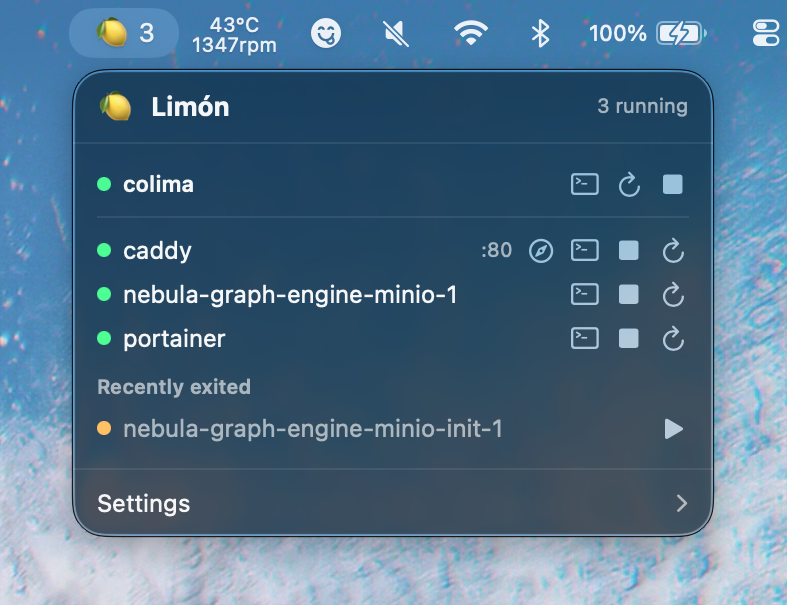

# Limón

Limón is a lightweight macOS menu bar app for managing a local
[Colima](https://github.com/abiosoft/colima) environment and its Docker
containers.

<p align="center">
  
</p>

From the menu bar, you can start or stop Colima, inspect containers, open
shells and logs, restart workloads, and review images and volumes.

## Requirements

- macOS 14 or later
- Xcode Command Line Tools
- [Colima](https://github.com/abiosoft/colima) and the Docker CLI

## Build

```sh
make
open "Limón.app"
```

Other useful commands:

```sh
make run
make package
make install
make clean
```

The local build is ad-hoc signed. A distributable release should be signed
with an Apple Developer certificate and notarized.
